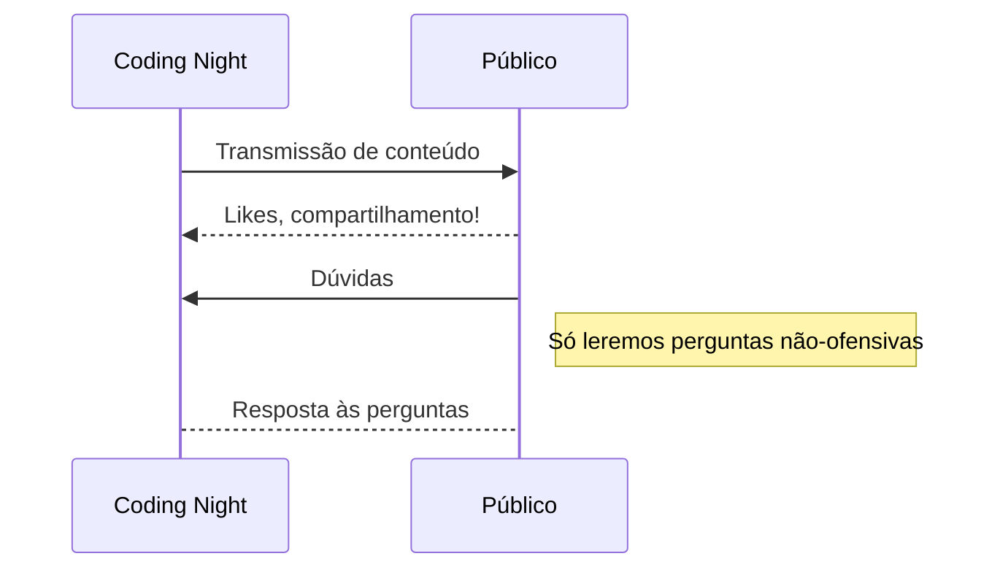

# MermaidCodingNight
Testes com diagramas do Mermaid em arquivos Markdown

---

```mermaid
sequenceDiagram
    participant C as Coding Night
    participant P as Público
    C->>P: Transmissão de conteúdo 
    P-->>C: Likes, compartilhamento!
    P->>C: Dúvidas
    Note right of P: Só leremos perguntas não-ofensivas
    C-->P: Resposta às perguntas
```